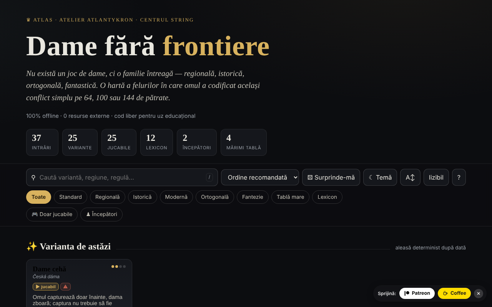

# Dame fără frontiere

Atlas al variantelor de dame, cu motoare de joc locale — într-un singur fișier HTML.

**Live:** https://chiuta.github.io/Dame-fara-frontiere/

## Ce este

Dame fără frontiere este un atlas interactiv al familiei de jocuri de dame (regionale, istorice, ortogonale, fantastice), pe table de 64, 100 sau 144 de pătrate. Fiecare variantă are o fișă cu reguli și date rapide, iar variantele jucabile pot fi jucate local împotriva calculatorului. Aplicația se declară companion al proiectului „Șah fără frontiere”.

## Funcții

- 25 de variante (internațională, englezească, braziliană, rusească, canadiană, italiană, spaniolă, portugheză, cehă, germană, pool, varianta uzuală RO, thailandeză, turcească, frizonă, armenească, Dameo, Croda, Lasca, Bașni, Cheskers, Damath, antidame, antidame internațională, dame diagonală) și 12 intrări de lexicon (damă, captură obligatorie, captură maximă, damă zburătoare, notație numerică, FMJD, promovare etc.).
- Căutare, sortare (ordine recomandată, titlu A→Z / Z→A, dificultate crescătoare / descrescătoare), filtre „Doar jucabile” și „Începători”, „Varianta de astăzi” (aleasă determinist după dată), „Surprinde-mă”.
- Joc local „Joacă local · vs AI”: alegi culoarea (Albe / Negre) și nivelul (Ușor / Mediu / Avansat), cu „Joc nou”, „Anulează”, „Indiciu” și „Mod relaxat” (captură neobligatorie).
- Motoare locale: generic parametrizat, de turnuri (Bașni, Lasca), de scor aritmetic (Damath) și hibrid șah×dame (Cheskers), cu căutare alpha-beta. Aplicația avertizează cu ⚠ variantele implementate aproximativ.
- Export CSV al listei și citare BibTeX.
- Temă luminoasă/întunecată, mărime text „lizibil”.

## Manual de utilizare

1. Deschide pagina și răsfoiește cardurile; filtrează cu „Doar jucabile” sau „Începători”, sau caută cu `/`.
2. Deschide o fișă (rezumat, „Reguli cheie”, „Date rapide”, „Înrudite”).
3. Dacă varianta are motor, apasă „▶ Joacă local · vs AI”, alege culoarea și nivelul.
4. Pe tablă apasă o piesă, apoi un pătrat evidențiat. La capturi multiple continuă să apeși pătratele; secvența se aplică când e completă.
5. Folosește „↶ Anulează”, „💡 Indiciu” sau „↺ Joc nou”; „Mod relaxat” face captura neobligatorie.
6. Scurtături: `/` focalizează căutarea, `R` variantă aleatoare, `B` filtru începători, `T` comută tema, `A` mărime text, `Esc` închide fereastra.
7. „⤓ Export CSV” descarcă lista; „⤓ Citează (BibTeX)” oferă citarea.
8. „Despre acest atlas →” explică tema, motoarele și limitele (motoare didactice, nu pentru analiză profesionistă).

## Confidențialitate și rețea

- **Stocare locală:** `localStorage`, chei cu prefixul `dff_` (temă, mod lizibil, variante explorate, un marcaj intern).
- **Rețea:** în cod nu există `fetch`, CDN sau resurse externe; aplicația afirmă „0 resurse externe”, fără cont și fără tracking. Linkurile către Patreon, Buy Me a Coffee, creativecommons.org sau alexio.tf sunt simple hiperlegături, deschise doar la click.

## Rulare locală / offline

Descarcă `index.html` și deschide-l în browser; nu necesită internet.

## Licență

Licența nu este încă declarată explicit în acest repository; vezi nota din aplicație. Aplicația conține în comentariul din cod o dedicare CC0 1.0, iar în subsolul interfeței menționează „CC-BY-SA 4.0”; cele două mențiuni nu coincid.

## Autor

Alexio — Alexandru-Ionuț Chiuță, contact: alexio@trom.tf. Aplicația menționează Atlantykron, Editura Tornada și Centrul StrING.

## English summary

An atlas of 25 draughts/checkers variants plus 12 lexicon entries, with local AI opponents (alpha-beta search) for playable variants. Single HTML file, Romanian interface, no external requests; theme and explored variants are stored in localStorage (`dff_` prefix). The license statements inside the app are inconsistent (CC0 in code comment, CC-BY-SA 4.0 in footer), so it is marked undeclared here.
